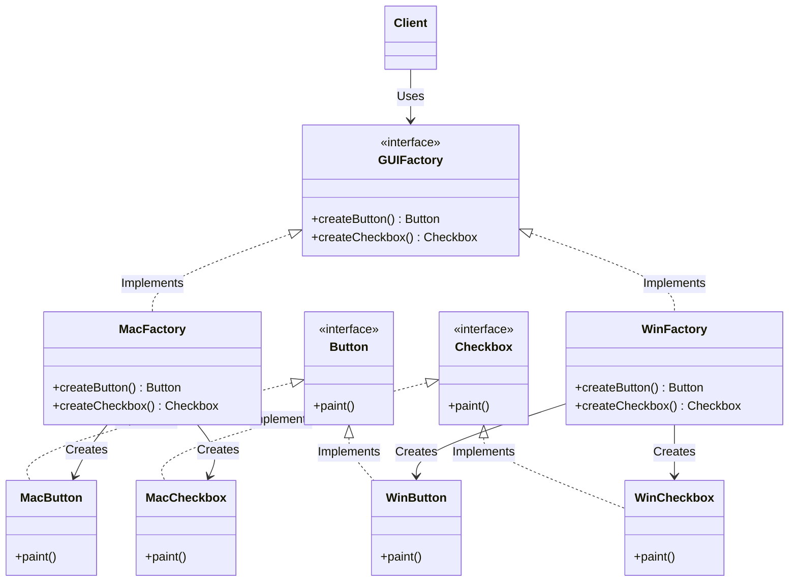

# Abstract Factory Design Pattern

## Overview
The **Abstract Factory Pattern** is a creational design pattern that lets you produce families of related or dependent objects without specifying their concrete classes.

Think of it as a "factory of factories." While a standard Factory Method creates one specific type of object, an Abstract Factory groups multiple related Factory Methods together. This ensures that the objects created by a specific factory are guaranteed to be compatible with each other.

## Architecture Diagram

Here is the UML class diagram for the Abstract Factory pattern:



## Java Implementation Example

Here is a practical example of a cross-platform UI module. The client needs to render a Button and a Checkbox, but they must match the current operating system. The Abstract Factory ensures a Mac button is never accidentally paired with a Windows checkbox.

```java
// 1. Abstract Products
public interface Button {
    void paint();
}

public interface Checkbox {
    void paint();
}

// 2. Concrete Products (Windows Family)
public class WinButton implements Button {
    @Override public void paint() { System.out.println("Rendering a Windows Button"); }
}

public class WinCheckbox implements Checkbox {
    @Override public void paint() { System.out.println("Rendering a Windows Checkbox"); }
}

// 3. Concrete Products (Mac Family)
public class MacButton implements Button {
    @Override public void paint() { System.out.println("Rendering a Mac Button"); }
}

public class MacCheckbox implements Checkbox {
    @Override public void paint() { System.out.println("Rendering a Mac Checkbox"); }
}

// 4. The Abstract Factory Interface
public interface GUIFactory {
    Button createButton();
    Checkbox createCheckbox();
}

// 5. Concrete Factories
public class WinFactory implements GUIFactory {
    @Override public Button createButton() { return new WinButton(); }
    @Override public Checkbox createCheckbox() { return new WinCheckbox(); }
}

public class MacFactory implements GUIFactory {
    @Override public Button createButton() { return new MacButton(); }
    @Override public Checkbox createCheckbox() { return new MacCheckbox(); }
}

// 6. Application Configuration & Client Code
public class Application {
    private Button button;
    private Checkbox checkbox;

    // The application doesn't know the concrete classes, just the factory interface
    public Application(GUIFactory factory) {
        button = factory.createButton();
        checkbox = factory.createCheckbox();
    }

    public void paintUI() {
        button.paint();
        checkbox.paint();
    }
}

public class Main {
    public static void main(String[] args) {
        Application app;
        GUIFactory factory;

        String osName = System.getProperty("os.name").toLowerCase();
        
        // Decide which factory to use based on the environment
        if (osName.contains("mac")) {
            factory = new MacFactory();
        } else {
            factory = new WinFactory();
        }

        // The app is safely configured with a matching family of products
        app = new Application(factory);
        app.paintUI();
    }
}
```

## Benefits & Trade-offs

    1. Product Compatibility: You are absolutely certain that the products you get from a factory are compatible with each other.

    2. Loose Coupling: The client code is decoupled from the concrete product classes. It only interacts with interfaces.

    3. Single Responsibility Principle: You extract the product creation code into a single place.

    4. Open/Closed Principle: You can introduce new variants of products (e.g., a LinuxFactory) without breaking existing client code.

    5. Trade-off (Extreme Complexity): The code becomes significantly more complicated. You have to introduce numerous new interfaces and classes.

    6. Trade-off (Rigidity): Adding a entirely new type of product (e.g., adding createTextField() to GUIFactory) requires updating the Abstract Factory interface and all of its concrete factory implementations.