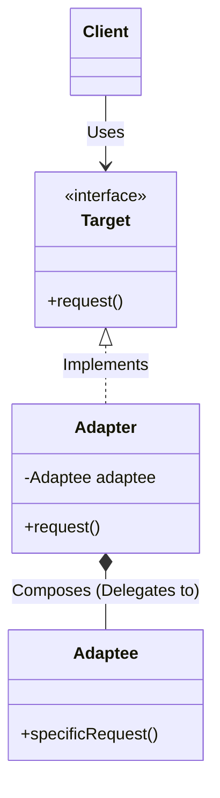

# Adapter Design Pattern

## Overview
The **Adapter Pattern** is a structural design pattern that allows incompatible interfaces to work together. It acts as a bridge between two objects, catching calls to one object and transforming them to a format recognizable by the second object.

## Architecture Diagram



Types of Adapters in Java
1. **Object Adapter (Composition-based)**

This implementation uses composition to hold an instance of the Adaptee and delegates calls to it.

    Pros: Highly flexible. A single adapter can work with the Adaptee and all of its subclasses.

    Cons: Cannot easily override Adaptee behavior since it doesn't inherit from it.

2. **Class Adapter (Inheritance-based)**

This implementation uses multiple inheritance. In Java, this means implementing a Target interface and extending an Adaptee class.

    Pros: Can override Adaptee methods directly. Creates a "two-way" adapter.

    Cons: In Java, the Target must be an interface. Requires extra delegation logic if the interface is large to avoid code duplication.

**Java Implementation Example**

Here is a practical example demonstrating how to adapt a legacy system to a new interface using composition and delegation to avoid code duplication.
```java
// 1. The Target Interface (what the client expects)
public interface ComplexTarget {
    void specificRequest();
    void standardTask();
}

// 2. A default implementation for standard tasks (prevents code duplication)
public class DefaultTargetImpl {
    public void standardTask() {
        System.out.println("Executing standard task logic...");
    }
}

// 3. The Adaptee (the legacy system we want to use)
public class LegacySystem {
    public void oldWayToDoThings() {
        System.out.println("Legacy system doing things the old way...");
    }
}

// 4. The Adapter (Class Adapter approach)
public class SystemAdapter extends LegacySystem implements ComplexTarget {
    
    // COMPOSITION: holding a reference to prevent duplication of standard logic
    private DefaultTargetImpl defaultImpl = new DefaultTargetImpl();

    @Override
    public void specificRequest() {
        // ADAPTING: translating the call for the legacy system
        this.oldWayToDoThings();
    }

    @Override
    public void standardTask() {
        // DELEGATION: passing the standard work to the default implementation
        defaultImpl.standardTask();
    }
}
```

Benefits & Trade-offs

* Single Responsibility Principle: Separates the data conversion code from the primary business logic.

* Open/Closed Principle: You can introduce new types of adapters without breaking the existing client code.

* Trade-off (Complexity): Increases overall code complexity by introducing new interfaces and classes.


### Pure Class Adapter Example (Inheritance-Based)

In a pure Class Adapter, the adapter **extends** the Adaptee class and **implements** the Target interface. It does not use composition.

```java
// 1. The Target Interface (what the client expects)
public interface Target {
    void request();
}

// 2. The Adaptee Class (the existing class we want to adapt)
public class Adaptee {
    public void specificRequest() {
        System.out.println("Called specificRequest() in Adaptee.");
    }
}

// 3. The Class Adapter 
// It inherits the Adaptee's behavior and fulfills the Target's contract.
public class ClassAdapter extends Adaptee implements Target {
    
    @Override
    public void request() {
        // We can directly call the method because we extended Adaptee
        this.specificRequest();
    }
}

// 4. Client Code
public class Main {
    public static void main(String[] args) {
        Target adapter = new ClassAdapter();
        // The client calls the target method, which is routed to the adaptee
        adapter.request(); 
    }
}

```
Key difference from Object Adapter: Notice there is no new Adaptee() or instance variable inside the ClassAdapter. It relies purely on the extends keyword to gain access to the Adaptee's methods.

### Object Adapter Example (Composition-Based)

In an Object Adapter, the adapter **implements** the Target interface and holds an instance of the Adaptee class via **composition**. This is generally the preferred approach because it is more flexible.

```java
// 1. The Target Interface (what the client expects)
public interface Target {
    void request();
}

// 2. The Adaptee Class (the existing class we want to adapt)
public class Adaptee {
    public void specificRequest() {
        System.out.println("Called specificRequest() in Adaptee.");
    }
}

// 3. The Object Adapter 
// It implements the Target interface and composes the Adaptee.
public class ObjectAdapter implements Target {
    
    private Adaptee adaptee; // Composition
    
    // Injecting the adaptee via constructor
    public ObjectAdapter(Adaptee adaptee) {
        this.adaptee = adaptee;
    }

    @Override
    public void request() {
        // Delegates the work to the adaptee object
        adaptee.specificRequest();
    }
}

// 4. Client Code
public class Main {
    public static void main(String[] args) {
        // Create the existing adaptee instance
        Adaptee adaptee = new Adaptee();
        
        // Pass it to the adapter
        Target adapter = new ObjectAdapter(adaptee);
        
        // The client calls the target method, which is routed to the adaptee instance
        adapter.request(); 
    }
}
```
**Key difference from Class Adapter: Notice that ObjectAdapter does not extend Adaptee. Instead, it declares a private Adaptee instance variable and requires it to be passed in through the constructor.**

**In this repo we just implemented the example of Object Adapter **