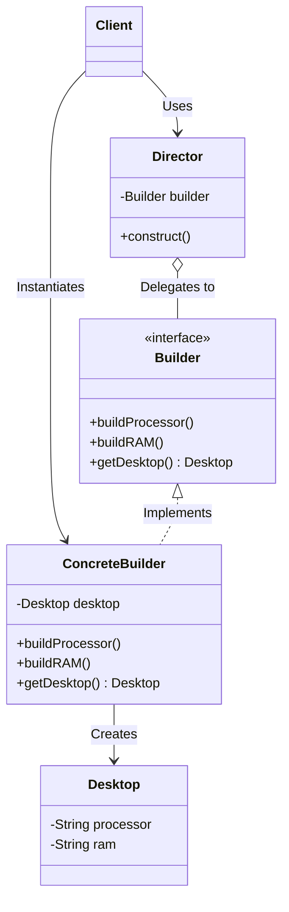

# Builder Design Pattern

## Overview
The **Builder Pattern** is a creational design pattern that lets you construct complex objects step by step. It allows you to produce different types and representations of an object using the same construction code.

It is primarily used to solve the "Telescoping Constructor" anti-pattern (where a class has multiple constructors with varying numbers of parameters) and to ensure that an object is completely initialized before it is used.

## Architecture Diagram

Here is the UML class diagram for the classic Gang of Four (GoF) Builder pattern involving a Director:



## Java Implementation Example

Here is the classic implementation using a Director to orchestrate the building process, while Concrete Builders provide the specific parts. This separates the construction logic from the actual product representation.

```java
// 1. The Product class
public class Desktop {
    private String brand;
    private String processor;
    private String memory;

    public void setBrand(String brand) { this.brand = brand; }
    public void setProcessor(String processor) { this.processor = processor; }
    public void setMemory(String memory) { this.memory = memory; }

    @Override
    public String toString() {
        return brand + " Desktop [Processor: " + processor + ", RAM: " + memory + "]";
    }
}

// 2. The Builder interface
public interface DesktopBuilder {
    void buildBrand();
    void buildProcessor();
    void buildMemory();
    Desktop getDesktop();
}

// 3. Concrete Builder
public class DellDesktopBuilder implements DesktopBuilder {
    private Desktop desktop = new Desktop();

    @Override public void buildBrand() { desktop.setBrand("Dell"); }
    @Override public void buildProcessor() { desktop.setProcessor("Intel Core i7"); }
    @Override public void buildMemory() { desktop.setMemory("16GB DDR5"); }
    @Override public Desktop getDesktop() { return desktop; }
}

// 4. The Director class
public class Director {
    private DesktopBuilder builder;

    public Director(DesktopBuilder builder) {
        this.builder = builder;
    }

    // Controls the sequence of object creation
    public void constructDesktop() {
        builder.buildBrand();
        builder.buildProcessor();
        builder.buildMemory();
    }
}

// 5. Client code
public class Main {
    public static void main(String[] args) {
        DesktopBuilder dellBuilder = new DellDesktopBuilder();
        Director director = new Director(dellBuilder);
        
        // The client only tells the director to build, completely abstracted from the steps
        director.constructDesktop();
        
        Desktop dellDesktop = dellBuilder.getDesktop();
        System.out.println(dellDesktop);
    }
}
```
**Note: In modern Java development, an alternative implementation using a static inner Builder class (Fluent Builder) is also highly popular for its concise method chaining without needing a separate Director class.**

## Benefits & Trade-offs
* Step-by-Step Construction: You have fine-grained control over the construction process.

* Separation of Concerns: Isolates complex construction code from the business logic of the product class.

* Varying Representations: You can use the exact same construction code (in the Director) to build completely different representations (Dell vs. HP).

* Trade-off (Complexity): Increases overall code complexity by requiring multiple new classes and interfaces for the builders and the director.