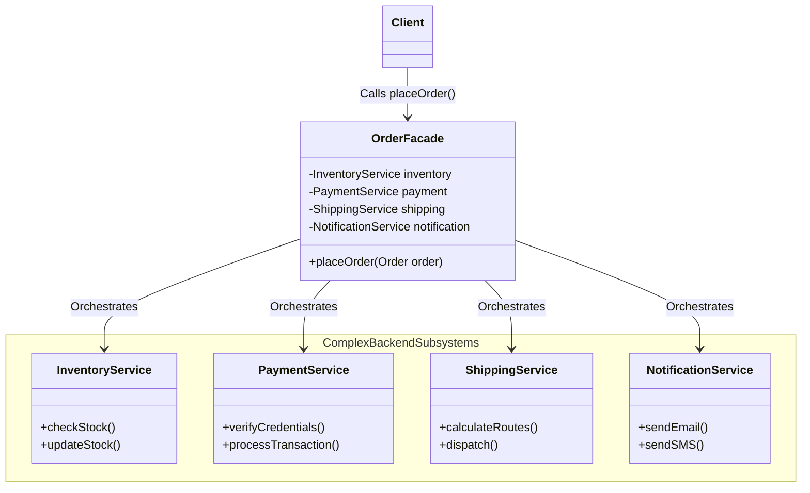

# Facade Design Pattern

## Overview
The **Facade Pattern** is a structural design pattern that provides a simple, unified interface to a complex system of classes, libraries, or frameworks.

Instead of making your client code interact directly with dozens of different classes and configuration steps, you create a "Facade" class that wraps all that complexity behind a single, easy-to-use method.

**Important Note:** A Facade does not *hide* the complex subsystem entirely. It just provides a convenient default. If advanced developers need to bypass the Facade to fine-tune the inner workings, they still can.

## Architecture Diagram

Here is the UML class diagram demonstrating how a Facade sits between the client and the complex backend subsystems:



## Java Implementation Example

In scalable backend systems, placing an order in an e-commerce application requires coordinating multiple microservices or internal modules. Without a Facade, the client (like an API controller) would be bloated with complex orchestration logic.

Here is how the Facade cleans this up:

```java
// 1. The Complex Subsystems
// These classes have a lot of complex logic, configurations, and steps.
class InventoryService {
    public boolean checkStock(String productId) {
        System.out.println("Checking inventory for: " + productId);
        return true; 
    }
}

class PaymentService {
    public boolean processPayment(String accountId, double amount) {
        System.out.println("Processing payment of $" + amount + " for account " + accountId);
        return true; 
    }
}

class ShippingService {
    public void createShippingLabel(String productId) {
        System.out.println("Creating shipping label for: " + productId);
    }
}

class NotificationService {
    public void sendOrderConfirmation(String accountId) {
        System.out.println("Sending confirmation email to account: " + accountId);
    }
}

// 2. The Facade Class
// It provides a simple, unified interface to the complex subsystems above.
public class OrderFacade {
    private final InventoryService inventoryService;
    private final PaymentService paymentService;
    private final ShippingService shippingService;
    private final NotificationService notificationService;

    public OrderFacade() {
        this.inventoryService = new InventoryService();
        this.paymentService = new PaymentService();
        this.shippingService = new ShippingService();
        this.notificationService = new NotificationService();
    }

    // The simplified method for the client
    public boolean placeOrder(String productId, String accountId, double amount) {
        System.out.println("=== Starting Order Process ===");
        
        if (!inventoryService.checkStock(productId)) {
            System.out.println("Order failed: Out of stock.");
            return false;
        }
        
        if (!paymentService.processPayment(accountId, amount)) {
            System.out.println("Order failed: Payment rejected.");
            return false;
        }
        
        shippingService.createShippingLabel(productId);
        notificationService.sendOrderConfirmation(accountId);
        
        System.out.println("=== Order Process Completed Successfully ===");
        return true;
    }
}

// 3. Client Code
public class Main {
    public static void main(String[] args) {
        // Without Facade: The client would have to instantiate all 4 services 
        // and manually call checkStock, processPayment, createLabel, etc.
        
        // With Facade: The client code is incredibly clean and decoupled.
        OrderFacade orderFacade = new OrderFacade();
        orderFacade.placeOrder("MacBook_Pro_16", "user_9921", 2499.99);
    }
}
```
***Note: In frameworks like Spring Boot, the Facade is often a @Service class that has various @Repository or other @Service beans injected into it, orchestrating a single @Transactional business operation.***

## Benefits & Trade-offs

* Loose Coupling: Decouples your client code from the complex backend subsystems. If the payment gateway changes, you only update the Facade, not the UI or API controllers.

* Simplified Interface: Makes the library or system much easier to use, understand, and test for the majority of use cases.

* Open/Closed Principle: You can introduce new subsystems (e.g., adding a TaxCalculationService) directly inside the Facade without touching the client code.

* Trade-off (The God Object): A Facade can easily grow out of control and become a "God Object" coupled to every single class in an application if you aren't careful. If it gets too large, you should split it into multiple, smaller facades.