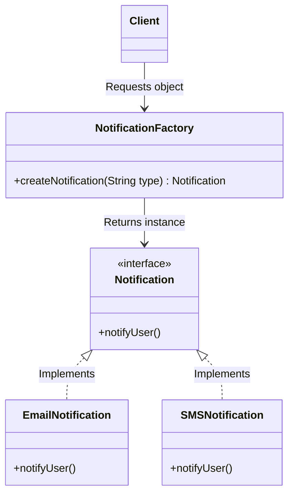

# Factory Design Pattern

## Overview
The **Factory Pattern** (or Factory Method Pattern) is a creational design pattern that provides an interface for creating objects, but allows subclasses to alter the type of objects that will be created.

Instead of calling a constructor directly using the `new` keyword, the client asks a "Factory" class to create the object. This hides the complex instantiation logic from the user.

## Architecture Diagram

Here is the UML class diagram for the Factory pattern:



## Java Implementation Example

Here is a practical example of a notification system where the client doesn't need to know the specific details of how an Email or SMS object is created.

```java
// 1. The Product Interface
public interface Notification {
    void notifyUser();
}

// 2. Concrete Product A
public class EmailNotification implements Notification {
    @Override
    public void notifyUser() {
        System.out.println("Sending an Email notification...");
    }
}

// 3. Concrete Product B
public class SMSNotification implements Notification {
    @Override
    public void notifyUser() {
        System.out.println("Sending an SMS notification...");
    }
}

// 4. The Factory Class
public class NotificationFactory {
    
    // The factory method that determines which object to instantiate
    public Notification createNotification(String channel) {
        if (channel == null || channel.isEmpty()) {
            return null;
        }
        
        switch (channel.toUpperCase()) {
            case "SMS":
                return new SMSNotification();
            case "EMAIL":
                return new EmailNotification();
            default:
                throw new IllegalArgumentException("Unknown channel " + channel);
        }
    }
}

// 5. Client Code
public class Main {
    public static void main(String[] args) {
        NotificationFactory factory = new NotificationFactory();
        
        // The client only interacts with the Factory and the Notification interface
        Notification notification1 = factory.createNotification("SMS");
        notification1.notifyUser();
        
        Notification notification2 = factory.createNotification("EMAIL");
        notification2.notifyUser();
    }
}
```

## Benefits & Trade-offs

    1. Single Responsibility Principle: You move the product creation code into one specific place in the program, making the code easier to support.

    2. Open/Closed Principle: You can introduce new types of products (e.g., PushNotification) into the program without breaking existing client code. You only update the Factory.

    3. Loose Coupling: The client code is completely decoupled from the concrete classes. It only knows about the Notification interface.

    4. Trade-off (Complexity): The code can become more complicated because you need to introduce a lot of new subclasses to implement the pattern.
