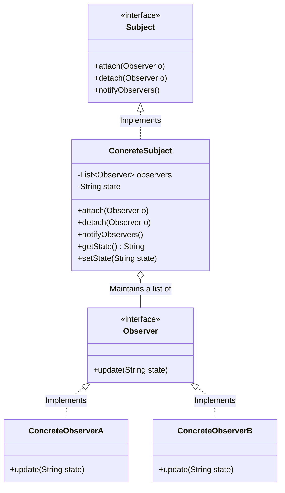

# Observer Design Pattern

## Overview
The **Observer Pattern** is a behavioral design pattern that establishes a one-to-many subscription mechanism. It allows multiple objects (observers or subscribers) to listen and react to events or state changes happening in another object (the subject or publisher).

This pattern is widely used in implementing distributed event handling systems, UI frameworks (like listeners on a button click), and the Model-View-Controller (MVC) architectural pattern.

## Architecture Diagram

Here is the UML class diagram for the Observer pattern:


## Java Implementation Example

Here is a practical example of a YouTube channel (the Subject) notifying its subscribers (the Observers) whenever a new video is uploaded.

```java
import java.util.ArrayList;
import java.util.List;

// 1. The Subject Interface
public interface Channel {
    void subscribe(Subscriber subscriber);
    void unsubscribe(Subscriber subscriber);
    void notifySubscribers();
}

// 2. The Observer Interface
public interface Subscriber {
    void update(String videoTitle);
}

// 3. Concrete Subject
public class YouTubeChannel implements Channel {
    private List<Subscriber> subscribers = new ArrayList<>();
    private String latestVideoTitle;

    @Override
    public void subscribe(Subscriber subscriber) {
        subscribers.add(subscriber);
    }

    @Override
    public void unsubscribe(Subscriber subscriber) {
        subscribers.remove(subscriber);
    }

    @Override
    public void notifySubscribers() {
        for (Subscriber subscriber : subscribers) {
            subscriber.update(latestVideoTitle);
        }
    }

    // Method to trigger a state change
    public void uploadVideo(String title) {
        this.latestVideoTitle = title;
        System.out.println("\n--- New Video Uploaded: " + title + " ---");
        notifySubscribers(); // Automatically notify everyone
    }
}

// 4. Concrete Observer
public class YouTubeSubscriber implements Subscriber {
    private String name;

    public YouTubeSubscriber(String name) {
        this.name = name;
    }

    @Override
    public void update(String videoTitle) {
        System.out.println("Hey " + name + ", a new video is out: '" + videoTitle + "'");
    }
}

// 5. Client Code
public class Main {
    public static void main(String[] args) {
        YouTubeChannel techChannel = new YouTubeChannel();

        // Create observers
        Subscriber bob = new YouTubeSubscriber("Bob");
        Subscriber alice = new YouTubeSubscriber("Alice");
        Subscriber charlie = new YouTubeSubscriber("Charlie");

        // Subscribe them to the channel
        techChannel.subscribe(bob);
        techChannel.subscribe(alice);
        techChannel.subscribe(charlie);

        // Upload a video - all subscribers get notified
        techChannel.uploadVideo("Observer Pattern in Java");

        // Charlie decides to unsubscribe
        techChannel.unsubscribe(charlie);

        // Upload another video - only Bob and Alice get notified
        techChannel.uploadVideo("Advanced Microservices");
    }
}
```

## Benefits & Trade-offs

Open/Closed Principle: You can introduce new subscriber classes without having to change the publisher's code, and vice versa.

* Loose Coupling: The subject only knows that the observer implements a specific interface (update() method). It doesn't need to know the concrete class of the observer.

* Dynamic Subscriptions: You can establish relations between objects at runtime, allowing observers to subscribe or unsubscribe whenever necessary.

* Trade-off (Unexpected Updates): Because observers are loosely coupled, a seemingly harmless change in the subject can trigger a cascade of updates, which might be hard to debug.

* Trade-off (Memory Leaks): A common issue known as the "Lapsed Listener Problem" occurs if observers are not explicitly unsubscribed. The subject continues to hold a strong reference to the observer, preventing it from being garbage collected.