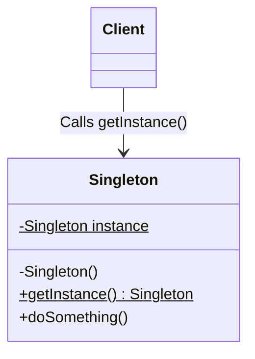

# Singleton Design Pattern

## Overview
The **Singleton Pattern** is a creational design pattern that ensures a class has only one instance and provides a global point of access to that instance.

It is commonly used for logging, database connections, configuration settings, or thread pools—scenarios where having more than one object would cause issues, unexpected behavior, or unnecessary resource consumption.

## Architecture Diagram

Here is the UML class diagram for the Singleton pattern:



## Java Implementation Example

There are several ways to implement a Singleton in Java, but the most robust approach for multithreaded applications is the Double-Checked Locking method. This ensures thread safety while maintaining high performance (by avoiding synchronization overhead every time the instance is requested).

```java
// 1. The Singleton Class
public class DatabaseConnection {

    // 1. Private static variable to hold the single instance
    // The 'volatile' keyword ensures that multiple threads handle the instance correctly
    private static volatile DatabaseConnection instance;

    // 2. Private constructor to prevent instantiation from outside the class
    private DatabaseConnection() {
        // Optional: Add protection against instantiation via Reflection
        if (instance != null) {
            throw new RuntimeException("Use getInstance() method to get the single instance of this class.");
        }
        System.out.println("Database Connection initialized.");
    }

    // 3. Public static method to provide the global point of access
    public static DatabaseConnection getInstance() {
        // First check (no locking) - makes it fast for subsequent calls
        if (instance == null) {
            // Only lock the block if the instance hasn't been created yet
            synchronized (DatabaseConnection.class) {
                // Second check (with locking) - prevents multiple threads from creating multiple instances
                if (instance == null) {
                    instance = new DatabaseConnection();
                }
            }
        }
        return instance;
    }

    // Example business method
    public void executeQuery(String query) {
        System.out.println("Executing query: " + query);
    }
}

// 2. Client Code
public class Main {
    public static void main(String[] args) {
        // Illegal construct - Compile Time Error: The constructor DatabaseConnection() is not visible
        // DatabaseConnection db = new DatabaseConnection();

        // Get the only object available
        DatabaseConnection db1 = DatabaseConnection.getInstance();
        db1.executeQuery("SELECT * FROM users");

        // Try to get another instance
        DatabaseConnection db2 = DatabaseConnection.getInstance();
        
        // Verify that both references point to the exact same object in memory
        if (db1 == db2) {
            System.out.println("db1 and db2 are the exact same instance.");
        }
    }
}
```
## Benefits & Trade-offs

    1. Guaranteed Single Instance: You can be absolutely certain that a class has only a single instance.

    2. Global Access: You get a global access point to that instance, but it is strictly controlled by the class itself.

    3. Lazy Initialization: The singleton object is initialized only when it's requested for the first time (if implemented securely).

    4. Trade-off (SRP Violation): It violates the Single Responsibility Principle because the class solves two problems at once: managing its own lifecycle and performing its actual business logic.

    5. Trade-off (Testing): Singletons can make unit testing difficult because they introduce global state into an application, and mock objects cannot easily replace the Singleton instance.

    6. Trade-off (Multithreading): Requires special handling (like volatile and synchronized blocks in Java) to remain safe in a multithreaded environment.