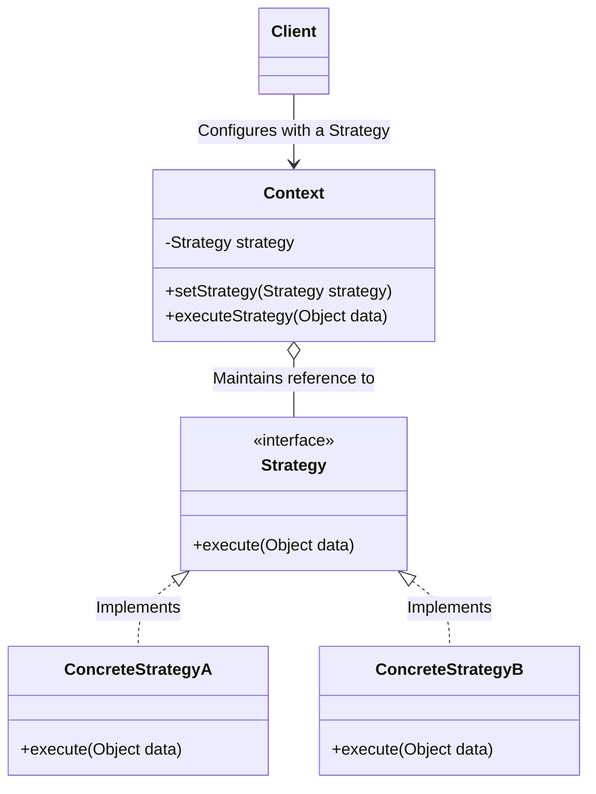

# Strategy Design Pattern

## Overview
The **Strategy Pattern** is a behavioral design pattern that turns a set of behaviors into objects and makes them interchangeable inside an original context object.

It is heavily used to eliminate large conditional statements (`if-else` / `switch`) and to strictly adhere to the **Open/Closed Principle** (your core system is closed for modification, but open for extension by adding new strategies).

## Architecture Diagram

Here is the UML class diagram for the Strategy pattern:



## Java Implementation Example

In a scalable backend system, you might need to change how you cache data depending on the environment or the size of the payload. Instead of hardcoding the caching logic, we use the Strategy pattern.

```java
// 1. The Strategy Interface
public interface CacheStrategy {
    void write(String key, String payload);
}

// 2. Concrete Strategy A (For single-node or local dev)
public class InMemoryCacheStrategy implements CacheStrategy {
    @Override
    public void write(String key, String payload) {
        System.out.println("Writing '" + key + "' to local ConcurrentHashMap memory...");
    }
}

// 3. Concrete Strategy B (For distributed environments)
public class RedisCacheStrategy implements CacheStrategy {
    @Override
    public void write(String key, String payload) {
        System.out.println("Publishing '" + key + "' to distributed Redis cluster...");
    }
}

// 4. The Context Class
// This class delegates the work to the linked strategy object.
public class DataService {
    private CacheStrategy cacheStrategy;

    // The context doesn't know the concrete class of the strategy.
    // It works with all strategies via the interface.
    public void setCacheStrategy(CacheStrategy cacheStrategy) {
        this.cacheStrategy = cacheStrategy;
    }

    public void processData(String key, String data) {
        // ... some heavy business logic ...
        
        // Delegate the caching behavior to the injected strategy
        cacheStrategy.write(key, data);
    }
}

// 5. Client Code
public class Main {
    public static void main(String[] args) {
        DataService service = new DataService();

        // Runtime decision: Use Local Memory
        service.setCacheStrategy(new InMemoryCacheStrategy());
        service.processData("user:123", "{name: 'Abdus', role: 'admin'}");

        // Runtime decision: System scales up, switch to Redis dynamically
        service.setCacheStrategy(new RedisCacheStrategy());
        service.processData("user:124", "{name: 'Alice', role: 'user'}");
    }
}
```
***Note: In modern Java frameworks like Spring Boot, the Context (e.g., DataService) often has the Strategy injected automatically via @Autowired or constructor injection, and you can dynamically select which Spring Bean to use based on application properties or profiles.***

## Benefits & Trade-offs

* Open/Closed Principle: You can introduce new strategies (like MemcachedStrategy) without changing the DataService context.

* Eliminates Conditionals: Replaces complex if-else blocks with clean, polymorphic method calls.

* Runtime Flexibility: You can swap algorithms entirely at runtime based on the state of the system or external inputs.

* Trade-off (Awareness): The Client code must be aware of the different strategies to select the appropriate one.

* Trade-off (Class Explosion): Increases the number of classes in your project. If you only have a couple of algorithms that rarely change, this pattern might be over-engineering.

## Modern Java 8+ Implementation (Using Lambdas)

With Java 8, if your strategy interface has only one abstract method, it becomes a `@FunctionalInterface`. This means you can pass behaviors directly using lambda expressions or method references, eliminating the boilerplate of creating multiple concrete classes.

```java
// 1. The Functional Strategy Interface
@FunctionalInterface
public interface CacheStrategy {
    void write(String key, String payload);
}

// 2. The Context Class
public class DataService {
    private CacheStrategy cacheStrategy;

    public void setCacheStrategy(CacheStrategy cacheStrategy) {
        this.cacheStrategy = cacheStrategy;
    }

    public void processData(String key, String data) {
        // Delegate to the injected strategy
        cacheStrategy.write(key, data);
    }
}

// 3. Client Code using Java 8 Lambdas
public class Main {
    public static void main(String[] args) {
        DataService service = new DataService();

        // Strategy 1: Local Memory (defined inline via lambda)
        service.setCacheStrategy((key, payload) -> 
            System.out.println("Writing '" + key + "' to local ConcurrentHashMap memory...")
        );
        service.processData("user:123", "{name: 'Abdus', role: 'admin'}");

        // Strategy 2: Redis (defined inline via lambda)
        service.setCacheStrategy((key, payload) -> 
            System.out.println("Publishing '" + key + "' to distributed Redis cluster...")
        );
        service.processData("user:124", "{name: 'Alice', role: 'user'}");
        
        // Strategy 3: Method Reference (if logic is complex and extracted to another method)
        // service.setCacheStrategy(ExternalCacheUtil::writeToMemcached);
    }
}
```

## Why use the Java 8 approach?

* Less Boilerplate: You don't need to create InMemoryCacheStrategy.java, RedisCacheStrategy.java, etc.

* Highly Concise: The behavior is defined exactly where it is used.

* Perfect for Simple Algorithms: If your strategy is just a few lines of code, a lambda is much cleaner than a full class. (Note: If the strategy requires complex, multi-line logic or internal state, standard concrete classes are still preferred).